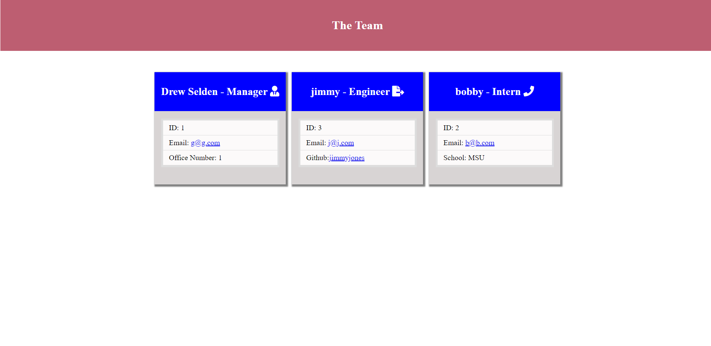

# Team Profile Genetator
  
  ## Description
  --This application can be used to create a team of employees and their manager. It will generate a webpage that displays the team's info like links to their emails and GitHub proflies.
  ## Table of Contents
  - [Installation](#installation)
  - [Usage](#usage)
  - [Credits](#credits)
  - [License](#license)
  ## Installation
  --Clone this repository and instal the required dependencies with the command 'npm install'.
  ## Usage
  --Once you have the required dependencies installed run 'node index' to start the app. You will be prompted with questions asking the details for each new employee. If the new entry is a manager then the office number will be asked. If the new entry is an engineer, the engineer's GitHub page will be asked. If the new entry is an intern, the intern's school will be asked. Once you have answered all prompts select 'done building' and an HTML page will be generated containing all the information about team you just input.
  
  ## License
  --https://opensource.org/licenses/MIT
   
  --This application is covered under the MIT license.
  ## How to Contribute
  --Feel free to contact me from the information provided below if you have any questions.
  ## Tests
  --Yes, type 'npm run test' in the terminal to see the tests run and pass.
  ## Questions
  --My GitHub account is https://github.com/selden-CBC2021

  --If you have any questions please email me at seldend1@gmail.com
  